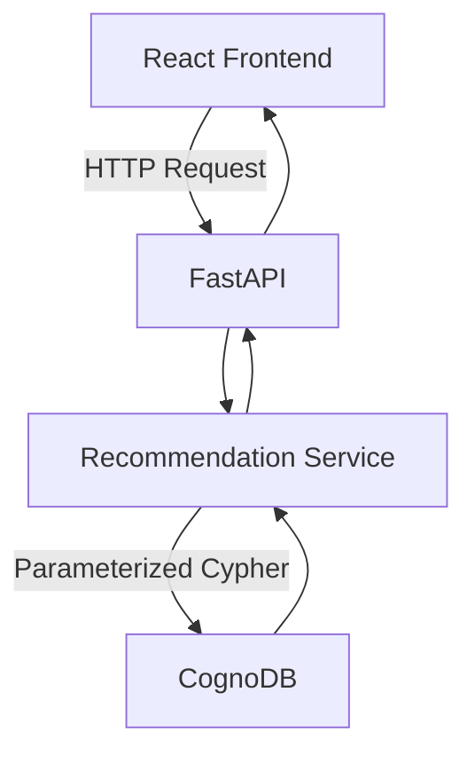
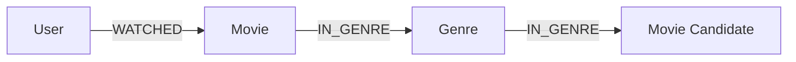
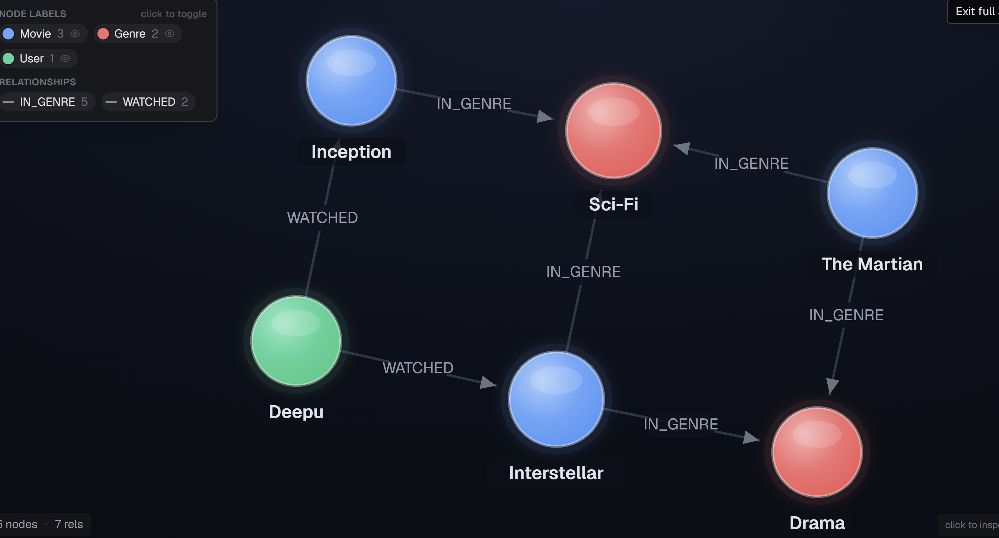

# CineGraph AI

CineGraph AI is a graph-based movie recommendation application built with **React, FastAPI, and CognoDB**.

The application accepts a username and recommends movies based on the genres of movies that user has already watched.

## What it does

For a given user, the application:

1. Finds movies the user has watched.
2. Finds the genres of those movies.
3. Traverses those genre relationships to discover other movies.
4. Excludes movies the user has already watched.
5. Groups candidates by movie.
6. Ranks recommendations by the number of matching genres.

For example, for `Deepu`, the current sample graph recommends **The Martian** because it shares both `Sci-Fi` and `Drama` with movies Deepu has already watched.

---

## Why a graph database?

The main problem here is relationship discovery rather than simple record lookup.

A recommendation requires traversing:

```text
User
  │
  │ WATCHED
  ▼
Movie
  │
  │ IN_GENRE
  ▼
Genre
  ▲
  │ IN_GENRE
  │
Movie Candidate
```

This relationship is naturally represented in a graph.

With CognoDB, the recommendation can be expressed as a multi-hop traversal across `User → Movie → Genre → Movie`, while also checking whether the user has already watched the candidate.

This is the main reason a graph model fits this use case better than treating the data as independent movie, user, and genre records.

---

## Architecture



### Components

* **React** — username input and recommendation UI.
* **FastAPI** — exposes the REST API.
* **Recommendation Service** — contains the recommendation query and result processing.
* **CognoDB** — stores users, movies, genres, and their relationships.
* **Neo4j Python Driver** — used to connect to CognoDB over Bolt.

---

## Graph Data Model



### Nodes

| Node    | Properties            |
| ------- | --------------------- |
| `User`  | `id`, `name`          |
| `Movie` | `id`, `title`, `year` |
| `Genre` | `name`                |

### Relationships

| Relationship | From  | To    |
| ------------ | ----- | ----- |
| `WATCHED`    | User  | Movie |
| `IN_GENRE`   | Movie | Genre |

---

## Recommendation Query

The core recommendation uses a multi-hop Cypher traversal:

```cypher
MATCH
    (u:User {name: $user_name})
    -[:WATCHED]->
    (watched:Movie)
    -[:IN_GENRE]->
    (genre:Genre)
    <-[:IN_GENRE]-
    (recommended:Movie)

WHERE NOT (u)-[:WATCHED]->(recommended)

RETURN
    recommended.title AS recommendation,
    collect(DISTINCT genre.name) AS matching_genres,
    count(DISTINCT genre) AS match_count

ORDER BY match_count DESC
```

The query is parameterized using `$user_name`; the username is passed separately through the Neo4j driver rather than being concatenated into the Cypher string.

### Recommendation flow

```text
User
 ↓
Movies already watched
 ↓
Genres of those movies
 ↓
Other movies using those genres
 ↓
Remove already-watched movies
 ↓
Group by candidate movie
 ↓
Count matching genres
 ↓
Rank recommendations
```

---

## Example

Request:

```text
GET /recommendations/Deepu
```

Response:

```json
{
  "user": "Deepu",
  "recommendations": [
    {
      "recommendation": "The Martian",
      "matching_genres": [
        "Sci-Fi",
        "Drama"
      ],
      "match_count": 2
    }
  ]
}
```

For `Rahul`, the current sample graph produces recommendations including `Interstellar` and `The Martian`.

---

## API

### Health check

```text
GET /
```

### Recommendations

```text
GET /recommendations/{user_name}
```

Example:

```text
GET /recommendations/Deepu
GET /recommendations/Rahul
```

Swagger documentation is available locally at:

```text
http://127.0.0.1:8000/docs
```

---

## Project Structure

```text
CineGraph AI/
│
├── backend/
│   ├── __init__.py
│   ├── db.py
│   ├── main.py
│   ├── recommendations.py
│   ├── seed.py
│   ├── test_db.py
│   └── test_recommendation.py
│
├── frontend/
│   ├── src/
│   │   ├── components/
│   │   ├── services/
│   │   ├── App.jsx
│   │   ├── App.css
│   │   ├── index.css
│   │   └── main.jsx
│   ├── public/
│   ├── package.json
│   ├── package-lock.json
│   └── vite.config.js
│
├── docs/
│   └── screenshots/
│       └── cognodb-recommendation-graph.png
│
├── .gitignore
├── README.MD
└── requirements.txt
```

---

## Setup

### Prerequisites

* Python 3.10+
* Node.js and npm
* A CognoDB instance

### 1. Clone the repository

```bash
git clone https://github.com/DeepuNarayana/cinegraph-ai.git
cd cinegraph-ai
```

### 2. Configure CognoDB

Create a `.env` file in the project root:

```env
COGNODB_URI=your_cognodb_uri
COGNODB_USER=cognodb
COGNODB_PASSWORD=your_cognodb_password
COGNODB_DATABASE=neo4j
```

The `.env` file is excluded from Git and should never be committed.

### 3. Install backend dependencies

```bash
python -m venv .venv
```

Windows:

```powershell
.venv\Scripts\Activate.ps1
```

Install dependencies:

```bash
pip install -r requirements.txt
```

### 4. Seed the graph

From the project root:

```bash
python -m backend.seed
```

The seed script creates the sample users, movies, genres, and relationships used by the application.

### 5. Start the backend

```bash
uvicorn backend.main:app --reload
```

Backend:

```text
http://127.0.0.1:8000
```

Swagger:

```text
http://127.0.0.1:8000/docs
```

### 6. Start the frontend

Open another terminal:

```bash
cd frontend
npm install
npm run dev
```

Vite will display the frontend URL in the terminal.

---

## Sample Graph

The screenshot below shows the actual recommendation graph in CognoDB.



The graph demonstrates the relationships used by the recommendation query, including:

`Deepu → WATCHED → Movie → IN_GENRE → Genre → IN_GENRE → Candidate Movie`

---

## Configuration

Database configuration is handled in `backend/db.py`.

The application reads:

```text
COGNODB_URI
COGNODB_USER
COGNODB_PASSWORD
COGNODB_DATABASE
```

from environment variables.

Credentials are not stored in the source code or committed to the repository.

---

## Demo

**Hosted application:**
*To be added after deployment.*

**Screen recording:**
*To be added after recording the final walkthrough.*

---


