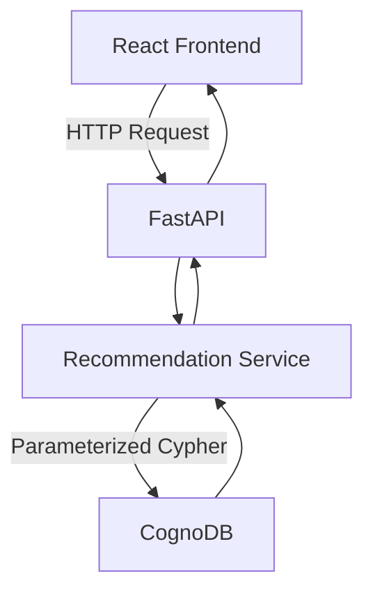
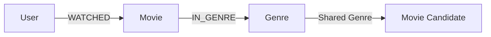
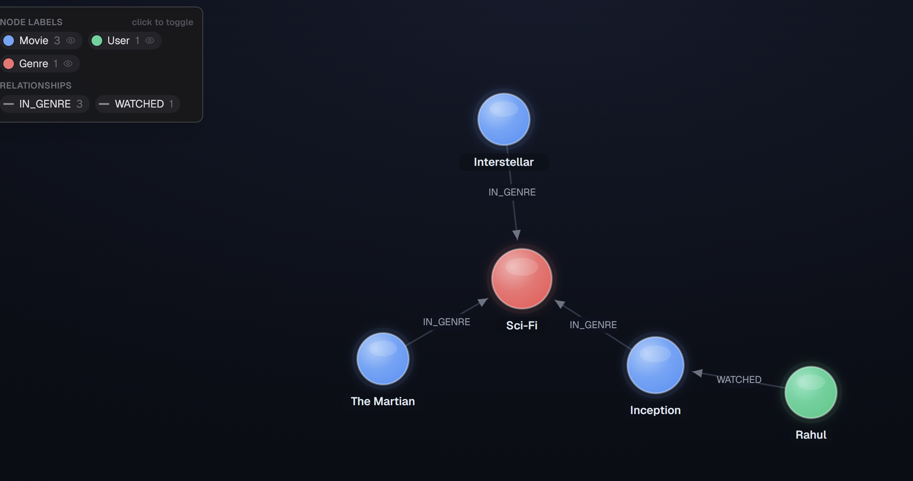

# CineGraph AI

CineGraph AI is a graph-based movie recommendation application built with **React, FastAPI, and CognoDB**.

The application accepts a username and recommends movies based on the genres of movies that user has already watched.

## Live Demo

- **Frontend:** https://cinegraph-ai-6.onrender.com
- **Backend API:** https://cinegraph-ai-5.onrender.com
- **Swagger API Docs:** https://cinegraph-ai-5.onrender.com/docs
- **GitHub:** https://github.com/DeepuNarayana/cinegraph-ai
---

## What it does

For a given user, the application:

1. Finds movies the user has watched.
2. Finds the genres associated with those movies.
3. Traverses the graph to discover other movies sharing those genres.
4. Excludes movies the user has already watched.
5. Groups matching genres for each candidate movie.
6. Ranks recommendations by the number of matching genres.

For example, for `Deepu`, the current sample graph recommends **The Martian** because it shares both `Sci-Fi` and `Drama` with movies Deepu has already watched.

---

## Why a graph database?

The main problem in this application is relationship discovery rather than simple record lookup.

A recommendation requires traversing:
User
  │
  │ WATCHED
  ▼
Movie
  │
  │ IN_GENRE
  ▼
Genre
  ▲
  │ IN_GENRE
  │
Movie Candidate

This relationship is naturally represented as a graph.

With CognoDB, the recommendation traverses the relationship path:

```text
User → Movie → Genre → Movie Candidate
```

This allows the application to discover candidate movies through genres shared with movies the user has already watched.

---

## Architecture



### Components

- **React** — username input and recommendation UI.
- **FastAPI** — exposes the REST API.
- **Recommendation Service** — contains the graph query and recommendation result processing.
- **CognoDB** — stores users, movies, genres, and their relationships.
- **Neo4j Python Driver** — connects the backend to CognoDB.

---

## Graph Data Model



### Nodes

| Node | Properties |
|---|---|
| `User` | `id`, `name` |
| `Movie` | `id`, `title`, `year` |
| `Genre` | `name` |

### Relationships

| Relationship | From | To |
|---|---|---|
| `WATCHED` | User | Movie |
| `IN_GENRE` | Movie | Genre |

## Recommendation Approach

The recommendation process follows these steps:

```text
User
 ↓
Movies already watched
 ↓
Genres associated with watched movies
 ↓
Candidate movies sharing those genres
 ↓
Remove already-watched movies
 ↓
Group matching genres
 ↓
Count matching genres
 ↓
Sort by match count (descending)
 ↓
Final recommendations
```

The recommendation score is based on the number of genres shared between the candidate movie and the user's previously watched movies.

For example:

```text
Deepu
 │
 ├── WATCHED ──> Interstellar ──> Sci-Fi
 │
 └── WATCHED ──> The Notebook ──> Drama
                                  │
                                  ▼
                            Candidate Movie
                            The Martian
                            Sci-Fi + Drama
                                  │
                                  ▼
                            match_count = 2
```

## Recommendation Query

The recommendation service uses two Cypher queries.

### 1. Find movies already watched by the user

```cypher
MATCH (u:User {name: $user_name})-[:WATCHED]->(movie:Movie)
RETURN movie.title AS movie
```

The result is used to identify movies that should not appear again in the recommendations.

### 2. Find candidate movies through shared genres

```cypher
MATCH
    (u:User {name: $user_name})
    -[:WATCHED]->
    (watched:Movie)
    -[:IN_GENRE]->
    (genre:Genre)

MATCH
    (recommended:Movie)
    -[:IN_GENRE]->
    (genre)

RETURN
    recommended.title AS recommendation,
    collect(DISTINCT genre.name) AS matching_genres
```

The query finds movies connected to genres that are also connected to movies already watched by the requested user.

The username is passed as a Cypher parameter:

```python
{
    "user_name": user_name
}
```

rather than being concatenated directly into the query.

### 3. Remove watched movies

After the candidate query executes, the recommendation service removes movies that already appear in the user's watch history.

### 4. Rank recommendations

Each candidate receives a `match_count` based on the number of matching genres:

```python
match_count = len(row["matching_genres"])
```

The recommendations are then sorted in descending order of `match_count`.

This provides a simple and explainable recommendation score.

User
 ↓
watched_query
 ↓
Watch history
 ↓
recommendation_query
 ↓
Candidate movies
 ↓
Python filtering
 ↓
Genre match count
 ↓
Ranking

## Example

### Request

```text
GET /recommendations/Deepu
```

### Response

```json
{
  "user": "Deepu",
  "recommendations": [
    {
      "recommendation": "The Martian",
      "matching_genres": [
        "Sci-Fi",
        "Drama"
      ],
      "match_count": 2
    }
  ]
}
```

The recommendation is ranked based on the number of matching genres.

For example, `The Martian` matches both `Sci-Fi` and `Drama`, resulting in:

```text
match_count = 2
```

For another user such as `Rahul`, the recommendation results are calculated from that user's own `WATCHED` relationships in the graph.

---

## API

### Health Check

```text
GET /
```

Response:

```json
{
  "message": "CineGraph AI API is running"
}
```

### Get Recommendations

```text
GET /recommendations/{user_name}
```

Examples:

```text
GET /recommendations/Deepu
GET /recommendations/Rahul
```

### Swagger Documentation

The interactive API documentation is available at:

https://cinegraph-ai-5.onrender.com/docs

## Project Structure

```text
CineGraph AI/
├── backend/
│   ├── __init__.py
│   ├── db.py
│   ├── main.py
│   ├── recommendations.py
│   ├── seed.py
│   ├── test_db.py
│   └── test_recommendation.py
│
├── frontend/
│   ├── src/
│   │   ├── components/
│   │   ├── services/
│   │   ├── App.jsx
│   │   ├── App.css
│   │   ├── index.css
│   │   └── main.jsx
│   ├── public/
│   ├── package.json
│   ├── package-lock.json
│   └── vite.config.js
│
├── docs/
│   └── screenshots/
│
├── .gitignore
├── README.MD
└── requirements.txt
```

### Backend

- `main.py` — FastAPI application and API endpoints.
- `recommendations.py` — graph-based recommendation logic.
- `db.py` — CognoDB connection and query execution.
- `seed.py` — creates the sample graph data.
- `test_db.py` — database connectivity tests.
- `test_recommendation.py` — recommendation flow tests.

### Frontend

- `App.jsx` — main recommendation interface.
- `components/` — reusable UI components.
- `services/api.js` — communication with the FastAPI backend.

## Tech Stack

### Backend

- **Python**
- **FastAPI** — REST API
- **Uvicorn** — ASGI server
- **Neo4j Python Driver** — database connectivity
- **CognoDB** — graph database
- **Cypher** — graph query language

### Frontend

- **React**
- **Vite**
- **JavaScript**
- **CSS**

### Testing

- **Python tests** for database connectivity and recommendation logic

### Deployment

- **GitHub** — source code repository
- **Render** — frontend and backend deployment

## Local Setup

### Prerequisites

- Python 3.10+
- Node.js and npm
- A CognoDB instance

### 1. Clone the repository

```bash
git clone https://github.com/DeepuNarayana/cinegraph-ai.git
cd cinegraph-ai
```

### 2. Configure environment variables

Create a `.env` file in the project root:

```env
COGNODB_URI=your_cognodb_uri
COGNODB_USER=your_cognodb_user
COGNODB_PASSWORD=your_cognodb_password
COGNODB_DATABASE=your_cognodb_database
FRONTEND_URL=http://localhost:5173
```

Do not commit the `.env` file. It is excluded through `.gitignore`.

### 3. Create and activate the Python virtual environment

From the project root:

```powershell
python -m venv .venv
```

Activate it on Windows:

```powershell
.venv\Scripts\Activate.ps1
```

### 4. Install backend dependencies

From the project root:

```powershell
pip install -r requirements.txt
```

### 5. Seed the graph database

From the project root:

```powershell
python -m backend.seed
```

This creates the sample users, movies, genres, and relationships required by the application.

### 6. Start the backend

From the project root:

```powershell
python -m uvicorn backend.main:app --reload
```

The backend will be available at:

```text
http://127.0.0.1:8000
```

Swagger documentation:

```text
http://127.0.0.1:8000/docs
```

### 7. Start the frontend

Open a second terminal:

```powershell
cd frontend
npm install
npm run dev
```

Vite will display the frontend URL, normally:

```text
http://localhost:5173
```

The frontend communicates with the FastAPI backend through the configured API base URL.

# CineGraph AI

Live Demo
    ↓
What it does
    ↓
Why a graph database?
    ↓
Architecture
    ↓
Graph Data Model
    ↓
Recommendation Approach
    ↓
Recommendation Query
    ↓
Example
    ↓
API
    ↓
Project Structure
    ↓
Tech Stack
    ↓
Local Setup
    ↓
Environment Variables
    ↓
Screenshots
    ↓
Deployment
    ↓
Demo

## Environment Variables
## Screenshots

### CognoDB Recommendation Graph

The following screenshots show the graph structure and relationships used by the recommendation system.




The graph demonstrates relationships such as:

```text
User
  │
  └── WATCHED → Movie
                  │
                  └── IN_GENRE → Genre
```

These relationships are traversed by the recommendation query to identify candidate movies based on shared genres.

## Deployment

The application is deployed as two services on Render.

```text
React Frontend
      │
      │ HTTPS
      ▼
FastAPI Backend
      │
      ▼
CognoDB
```

### Frontend

https://cinegraph-ai-6.onrender.com

### Backend

https://cinegraph-ai-5.onrender.com

### API Documentation

https://cinegraph-ai-5.onrender.com/docs

The production backend uses environment variables for database credentials and the frontend URL. Database credentials are not stored in the repository.

## Demo

The deployed application allows a user to enter a username and retrieve movie recommendations based on the user's existing watch history and shared genres.

### Demo Flow

1. Open the CineGraph AI frontend.
2. Enter a username such as `Deepu`.
3. Submit the recommendation request.
4. The frontend calls the FastAPI backend.
5. The backend queries CognoDB.
6. Recommendations are ranked by matching genre count.
7. The results are displayed in the frontend.

### Live Application

https://cinegraph-ai-6.onrender.com

### API Documentation

https://cinegraph-ai-5.onrender.com/docs